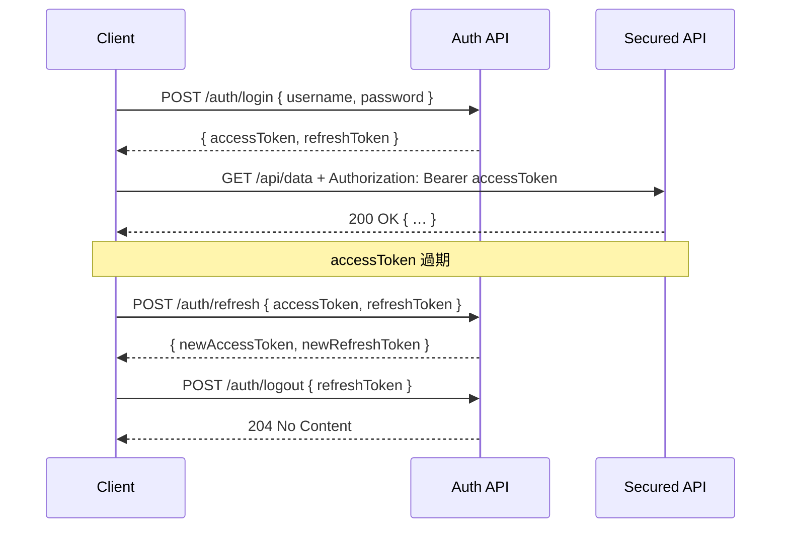

# Token-Based Authentication in .NET

> **Version**: 2025-05-16  
> **Platforms**: .NET Framework (up to 4.x) & .NET Core 6+  

---

## 1. 概覽

Token-Based 驗證（通常以 JWT 為主）流程大致分成：

1. **登入** (Login)  
2. **取得 Access Token (+ 可選 Refresh Token)**  
3. **呼叫受保護 API** (Bearer token in header)  
4. **Token 過期** → **Refresh** or **重新登入**  
5. **登出** (Invalidate / blacklisting refresh token)

---

## 2. 流程圖（Mermaid）



---

## 3. .NET Framework (4.x) 範例

### 3.1 安裝套件

```powershell
Install-Package System.IdentityModel.Tokens.Jwt
```

### 3.2 產生 JWT （Web API Controller）

```csharp
using System;
using System.IdentityModel.Tokens.Jwt;
using System.Security.Claims;
using Microsoft.IdentityModel.Tokens;
using System.Text;

// 1. 驗證 user/password (略)

// 2. 建立 Claims
var claims = new[]
{
    new Claim(JwtRegisteredClaimNames.Sub, userId),
    new Claim(JwtRegisteredClaimNames.Email, userEmail),
    // …自訂 claim
};

// 3. 建立 Signing Key
var key    = new SymmetricSecurityKey(Encoding.UTF8.GetBytes(ConfigurationManager.AppSettings["JwtKey"]));
var creds  = new SigningCredentials(key, SecurityAlgorithms.HmacSha256);

// 4. 建立 Token
var token = new JwtSecurityToken(
    issuer:   ConfigurationManager.AppSettings["JwtIssuer"],
    audience: ConfigurationManager.AppSettings["JwtAudience"],
    claims:   claims,
    expires:  DateTime.UtcNow.AddMinutes(30),
    signingCredentials: creds
);

// 5. 輸出
var jwtString = new JwtSecurityTokenHandler().WriteToken(token);
```

### 3.3 驗證 Middleware（OWIN）

在 `Startup.cs` 中加入：

```csharp
public void Configuration(IAppBuilder app)
{
    var issuer  = ConfigurationManager.AppSettings["JwtIssuer"];
    var audience = ConfigurationManager.AppSettings["JwtAudience"];
    var secret   = TextEncodings.Base64Url.Decode(ConfigurationManager.AppSettings["JwtKey"]);

    app.UseJwtBearerAuthentication(new JwtBearerAuthenticationOptions
    {
        AuthenticationMode = AuthenticationMode.Active,
        AllowedAudiences = new[] { audience },
        IssuerSecurityTokenProviders = new IIssuerSecurityTokenProvider[]
        {
            new SymmetricKeyIssuerSecurityTokenProvider(issuer, secret)
        }
    });

    // …其他 middleware
}
```

---

## 4. .NET Core 6+ 範例

### 4.1 安裝套件

```bash
dotnet add package Microsoft.AspNetCore.Authentication.JwtBearer
```

### 4.2 `Program.cs` 或 `Startup.cs` 設定

```csharp
var builder = WebApplication.CreateBuilder(args);

builder.Services
    .AddAuthentication(JwtBearerDefaults.AuthenticationScheme)
    .AddJwtBearer(options =>
    {
        options.TokenValidationParameters = new TokenValidationParameters
        {
            ValidateIssuer           = true,
            ValidateAudience         = true,
            ValidateLifetime         = true,
            ValidateIssuerSigningKey = true,
            ValidIssuer              = builder.Configuration["Jwt:Issuer"],
            ValidAudience            = builder.Configuration["Jwt:Audience"],
            IssuerSigningKey         = new SymmetricSecurityKey(
                                          Encoding.UTF8.GetBytes(builder.Configuration["Jwt:Key"]))
        };
    });

builder.Services.AddAuthorization();
var app = builder.Build();

app.UseAuthentication();
app.UseAuthorization();

app.MapControllers();

app.Run();
```

### 4.3 Controller 範例

```csharp
[ApiController]
[Route("api/[controller]")]
public class OrdersController : ControllerBase
{
    [HttpGet]
    [Authorize]
    public IActionResult GetAll()
    {
        var userId = User.FindFirstValue(JwtRegisteredClaimNames.Sub);
        // … your logic
        return Ok(orders);
    }
}
```

---

## 5. .NET Framework vs .NET Core 差異

| 特性                       | .NET Framework 4.x                            | .NET Core 6+                                |
|----------------------------|-----------------------------------------------|---------------------------------------------|
| **Middleware 設定**        | OWIN Pipeline (`app.UseJwtBearerAuthentication`) | Built‑in Middleware (`app.UseAuthentication`) |
| **Dependency Injection**   | 手動 / 第三方 DI 套件                          | 內建 DI Container                            |
| **配置來源**               | `web.config` / `app.config`                   | `appsettings.json` / 環境變數                |
| **程式範本**               | `Startup.cs` + Global.asax                     | `Program.cs`（Minimal API 可混用）           |
| **效能與跨平台**           | Windows Only                                  | Windows / Linux / macOS                     |

---

> 建議路徑： `docs/authentication/token-based.md`
